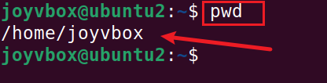

# linux Project Implementation

In this project we will be implementing some basic linux commands 

## Sudo commands

The Sudo command is also know as the super user do command which is used to grant administrative priviledges to a certain user to manipulate root files and folders.

To use the sudo command we use the following syntax `sudo apt upgrade`

## PWD command

this shows your present working directory.

## cd command

it is used to change your present working directory.

